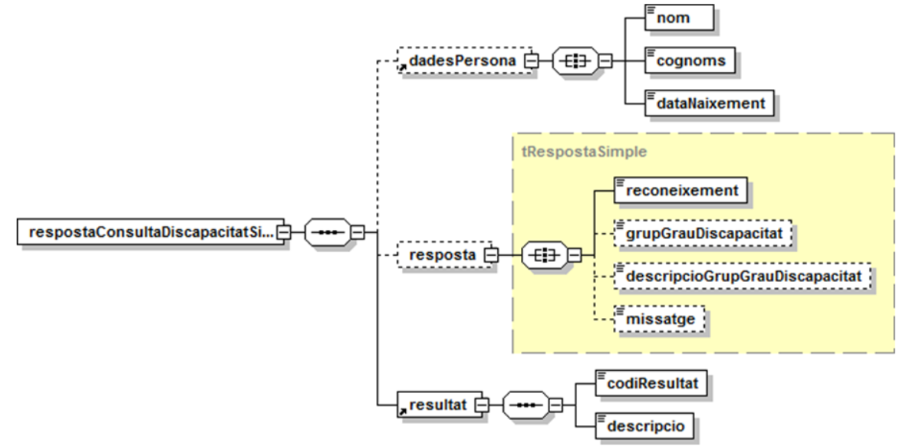

# VO-GRAU_DISCAPACITAT Document d&#39;integració del servei

# **Via Oberta – Grau de discapacitat (ICASS)**

## INDEX

- [1. Introducció](#1)
- [2. Transmissions de dades disponibles](#2)
- [3. Missatgeria del servei](#3)
   * [3.1 Grau de discapacitat – dades bàsiques (GRAU_DISCAPACITAT_SIMPLE)](#3.1)
        * [3.1.1 Petició](#3.1.1)
		* [3.1.2 Resposta – dades específiques](#3.1.2)
   * [3.2 Grau de discapacitat – dades avançades (GRAU_DISCAPACITAT_TOTAL)](#3.2)
        * [3.2.1 Petició](#3.2.1)
		* [3.2.2 Resposta – dades específiques](#3.2.2)
   * [3.3 Grau de discapacitat – dades avançades ampliades (GRAU_DISCAPACITAT_AMPLIADA)](#3.3)	
   		* [3.3.1 Petició](#3.2.1)
		* [3.3.2 Resposta – dades específiques](#3.2.2)
-  [4. Joc de proves](#4)

# 1 Introducció 

Aquest document detalla la missatgeria associada al servei de consulta del Grau de Discapacitat deldelServeialDisminuït(SAD)del&#39;InstitutCatalàd&#39;AssistènciaiServeisSocials(ICASSenendavant).

Per poder realitzar la integració cal conèixer prèviament la següent documentació:

- [Document de Missatgeria Genèrica de la PCI del Consorci AOC.][PCI]

[PCI]:https://github.com/ConsorciAOC/PCI

# 2 Transmissions de dades disponibles 

Les dades disponibles a través del servei són les que es presenten a continuació:

| **EMISSOR** |
| --- |
| ICASS (Institut Català d'Assistència i Serveis Socials) |

| **PRODUCTE** | **MODALITAT** | **DESCRIPCIO** |
| --- | --- | --- |
| **GRAU\_DISCAPACITAT** | GRAU\_DISCAPACITAT\_SIMPLE | Grau de discapacitat d’un ciutadà (dades bàsiques). |
| **GRAU\_DISCAPACITAT** | GRAU\_DISCAPACITAT\_TOTAL | Grau de discapacitat d’un ciutadà (dades avançades). |
| **GRAU\_DISCAPACITAT** | GRAU\_DISCAPACITAT\_AMPLIADA | Grau de discapacitat d’un ciutadà (dades avançades ampliades).|

Totes les consultes del producte tenen disponible la versió imprimible del resultat de la consulta en format PDF. Per més detalls adreceu-vos a l’apartat *Extensions de missatgeria* del document de [missatgeria genèrica.][PCI2]

[PCI2]:https://github.com/ConsorciAOC/PCI

# 3	Missatgeria del servei 

A continuació es detalla la missatgeria corresponent al bloc de dades específiques de les modalitats de consum del producte.

## 3.1	Grau de discapacitat – dades bàsiques (GRAU_DISCAPACITAT_SIMPLE) 

### 3.1.1	Petició 

Aquesta modalitat permet consultar les dades bàsiques del grau de discapacitat d’un ciutadà informant:

<li>El document identificatiu del titular a les dades genèriques de la missatgeria.

<li>Alternativament, informant les dades personals a la missatgeria específica.
 

#### 3.1.1.1	Dades genèriques

| _Element_ | _Descripció_ |
| --- | --- |
| //DatosGenericos/Titular/TipoDocumentacion | Tipus de documentació (DNI/NIF o NIE). |
| //DatosGenericos/Titular/Documentacion | Documentació. NIF en format DDDDDDDDL,NIE en format LDDDDDDDL (D:dígit,L:lletra). |

#### 3.1.1.2	Dades específiques

En cas de no disposar del document identificatiu del titular, el servei permet fer la consulta per les dades personals: nom, cognoms i data de naixement.

| _Element_ | _Descripció_ |
| --- | --- |
| /peticioConsultaDiscapacitatSimple/dadesPersona | Bloc de dades personals del titular que es vol consultar. |
| //dadesPersona/nom | Nom de la persona a consultar. En majúscules, sense accents ni dièresi i com a màxim de 16 caràcters. |
| //dadesPersona/cognoms | Cognoms de la persona a consultar. En majúscules, sense accents ni dièresi i com a màxim de 35 caràcters. És necessari indicar els dos cognoms de la persona (si en té). |
| //dadesPersona/dataNaixement | Data de naixement de la persona a consultar (DDMMAAAA). |

### 3.1.2	Resposta – dades específiques 

De l’schema associat a la resposta especifica, el servei informa les dades que es detallen a continuació.

| _Element_ | _Descripció_ |
| --- | --- |
| /respostaConsultaDiscapacitatSimple/dadesPersona |Bloc de dades personals del titular consultat si s’ha informat a la petició. Per més detalls consulteu l’apartat 3.1.1.2 d’aquest mateix document. |
| /respostaConsultaDiscapacitatSimple/resposta | Bloc de dades de la resposta a laconsulta. |
| //resposta/reconeixement | Disposa del reconeixement de grau dediscapacitat:<li> NO TROBAT:no estroba el ciutada a la base de dades del SAD.<li>SI: el ciutadà té reconegut un grau de discapacitat.<li> NO: el ciutadà no té reconegut un grau de discapacitat.<li>EN TRÀMIT: el reconeixement del grau de discapacitat està en tràmit.<li> CADUCAT I PENDENT DE NOVA REVISIÓ: el reconeixement del grau de discapacitat del ciutadà ha caducat i està pendent d&#39;una nova revisió. |
| //resposta/grupGrauDiscapacitat | Grau de discapacitat:<li> 1: pertany al grup 1, discapacitat del 0 % al 32 %.<li>2: pertany al grup 2, discapacitat del 33 % al 64 %.<li>3: pertany al grup 3, discapacitat del 65 % al 74 %.<li>4: pertany al grup 4, discapacitat del 75 % o més. |
| //resposta/descripcioGrupGrauDiscapacitat | Descripció del grup de grau de discapacitat al que pertany el titular. |
| //resposta/missatge | Descripció de la incidència detectada al realitzar la consulta. |
| //resultat/codiResultat | Codi de resultat de l’operació de consulta (vegeu apartat 0). |
| //resultat/descripcio | Descripció del resultat.. |

Segons el valor de *reconeixement* vindran informats els següents camps: <li>NO TROBAT</li><ul><ul><li>Missatge (si amb les dades subministrades no es poden comprovar els requeriments demanats cal definir amb més precisió la consulta).</ul></ul></li>
<li>SI</li>
<ul><ul><li>Grup de grau de discapacitat.</ul></ul></li>
<ul><ul><li>Descripció del grup de grau de discapacitat.</ul></ul></li>
<ul><ul><li>Missatge (si l’expedient ha estat traslladat a altra comunitat).</ul></ul></li>

<li>NO</li>
<ul><ul><li>Missatge (si l’expedient està de baixa).</ul></ul></li>

<li>EN TRÀMIT</li>
<ul><ul><li>Sense dades.</ul></ul></li>

<li>CADUCAT I PENDENT DE NOVA REVISIÓ</li>
<ul><ul><li>Grup de grau de discapacitat.</ul></ul></li>
<ul><ul><li>Descripció del grup de grau de discapacitat</ul></ul></li>

### 3.1.2.1 Codis de resultat

<li>0: Operació realitzada correctament.
<li>0502: Error en la comunicació amb l’emissor.

## 3.2	Grau de discapacitat – dades avançades (GRAU_DISCAPACITAT_TOTAL) 
    
### 3.2.1 Petició 

Aquesta modalitat permet consultar les dades avançades del grau de discapacitat d’un ciutadà informant: <li>El document identificatiu del titular a les dades genèriques de la missatgeria.
<li>Alternativament, informant les dades personals a la missatgeria específica.

      
#### 3.2.1.1 Dades genèriques

| _Element_ | _Descripció_ |
| --- | --- |
| //DatosGenericos/Titular/TipoDocumentacion | Documentació. NIF en format DDDDDDDDL, NIE en format LDDDDDDDL (D: dígit, L: lletra). |
| //DatosGenericos/Titular/Documentacion | Documentació. |

#### 3.2.1.2 Dadeses pecífiques

Anàlogament a la modalitat anterior, en cas de no disposar del document identificatiu del titular, el servei permet fer la consulta per les dades personals: nom, cognoms i data de naixement.

| _Element_ | _Descripció_ |
| --- | --- |
| /peticioConsultaDiscapacitatTotal/dadesPersona | Bloc de dades personals del titular que es volconsultar. |
| //dadesPersona/nom | Nom de la persona a consultar. En majúscules, sense accents ni dièresi i com a màxim de 16 caràcters. |
| //dadesPersona/cognoms | Cognoms de la persona a consultar. En majúscules, sense accents ni dièresi i com a màxim de 35 caràcters. És necessari indicar els dos cognoms de la persona (si en té). |
| //dadesPersona/dataNaixement | Data de naixement de la persona a consultar (DDMMAAAA). |

    
### 3.2.2	Resposta – dades específiques 

De l’schema associat a la resposta especifica, el servei informa les dades que es detallen a continuació.

| _Element_ | _Descripció_ |
| --- | --- |
| /respostaConsultaDiscapacitatTotal/dadesPersona | Bloc de dades personals del titular consultat si s’ha informat a la petició. Per
més detalls consulteu l’apartat 3.1.1.2 d’aquest mateix document. |
| /respostaConsultaDiscapacitatTotal/resposta | Bloc de dades de la resposta a la consulta. |
| //resposta/reconeixement | Disposa del reconeixement de grau de discapacitat:<li>NO TROBAT: no es troba el ciutada a la base de dades del SAD.<li>SI: el ciutadà té reconegut un grau de discapacitat.<li>NO: el ciutadàno té reconegut un grau de discapacitat.<li>EN TRÀMIT: el reconeixement del grau de discapacitat està en tràmit.<li>CADUCAT I PENDENT DE NOVA REVISIÓ: el reconeixement del grau de discapacitat del ciutadà ha caducat i està pendent d’una nova revisió. |
| //resposta/grauDiscapacitat | Grau de discapacitat indicat com a percentatge. |
| //resposta/dataEfecte | Data efecte del grau de discapacitat (DD-MM-AAAA). |
| //resposta/baremDependencia | Barem de dependència (SI / NO). SI: com a mínim té reconegut un 75% de discapacitat i un 25 del barem de dependència. |
| //resposta/baremMobilitat | Té reconegut barem de mobilitat (S / N). Barem per determinar l'existència de dificultats per utilitzar transports col·lectius (annex 3 del Real Decreto 1971/1999, de 23 de desembre de procediment per al reconeixement, declaració i qualificació del grau de discapacitat).|
| //resposta/acompanyantTransport | Necessita acompanyant per transport públic (S / N).|
| //resposta/validesa | Validesa del reconeixement (DEFINITIU /PROVISIONAL). |
| //resposta/dataVenciment | Data de venciment de la validesa si aquesta és PROVISIONAL (DDMMAAAA). |
| //resposta/missatge | Descripció de la incidència detectada al realitzar la consulta.|
| //resultat/codiResultat | Codi de resultat de l’operació de consulta (vegeu apartat 0). |
| //resultat/descripcio | Descripció del resultat. |

Segons el valor de l’element reconeixement s’informaran els següents elements a la resposta:
 <li>NO TROBAT
<ul><ul><li>Missatge (si amb les dades subministrades no es poden comprovar els requeriments demanats cal definir amb més precisió la consulta).</ul></ul>

<li>SI
<ul><ul><li>Grau de discapacitat</ul></ul>
<ul><ul><li>Data efecte</ul></ul>
<ul><ul><li>Barem de dependència</ul></ul>
<ul><ul><li>Barem de mobilitat</ul></ul>
<ul><ul><li>Acompanyant per transport públic</ul></ul>
<ul><ul><li>Validesa del reconeixement</ul></ul>
<ul><ul><li>Data de venciment de la validesa (si el valor de validesa és PROVISIONAL)</ul></ul>
<ul><ul><li>Missatge (si l’expedient ha estat traslladat a altra comunitat)</ul></ul>

<li>NO
<ul><ul><li>Missatge (si l’expedient està de baixa)</ul></ul>

<li>EN TRÀMIT
<ul><ul><li>Sense dades.</ul></ul>

<li>CADUCAT I PENDENT DE NOVA REVISIÓ</ul></ul>
<ul><ul><li>Grau de discapacitat.</ul></ul>
<ul><ul><li>Data efecte.</ul></ul>
<ul><ul><li>Barem de dependència.</ul></ul>
<ul><ul><li>Barem de mobilitat.</ul></ul>
<ul><ul><li>Acompanyant per transport públic.</ul></ul>
<ul><ul><li>Validesa del reconeixement.</ul></ul>
<ul><ul><li>Data de venciment de la validesa (si el valor de validesa és PROVISIONAL).</ul></ul>
<ul><ul><li>Missatge (si l’expedient ha estat traslladat a altra comunitat).</ul></ul>

## 3.3 Grau de discapacitat – dades avançades ampliades (GRAU_DISCAPACITAT_AMPLIADA) 

### 3.3.1 Petició 

Aquesta modalitat permet consultar les dades avançades ampliades del grau de discapacitat d’un ciutadà informant: <li>El document identificatiu del titular a les dades genèriques de la missatgeria.
<li>Alternativament, informant les dades personals a la missatgeria específica.

 Tant en la consulta per document identificatiu com per dades personals cal indicar a les dades específiques si es té el consentiment del ciutadà per a mostrar les dades corresponents als tipus de discapacitat.
      
#### 3.3.1.1 Dades genèriques

| _Element_ | _Descripció_ |
| --- | --- |
| //DatosGenericos/Titular/TipoDocumentacion | Documentació. NIF en format DDDDDDDDL, NIE en format LDDDDDDDL (D: dígit, L: lletra). |
| //DatosGenericos/Titular/Documentacion | Documentació. |

#### 3.3.1.2 Dadeses pecífiques

Anàlogament a la modalitat anterior, en cas de no disposar del document identificatiu del titular, el servei permet fer la consulta per les dades personals: nom, cognoms i data de naixement.

| _Element_ | _Descripció_ |
| --- | --- |
| /peticioConsultaDiscapacitatAmpliada/dadesPersona | Bloc de dades personals del titular que es vol consultar. |
| //dadesPersona/nom | Nom de la persona a consultar. En majúscules, sense accents ni dièresi i com a màxim de 16 caràcters. |
| //dadesPersona/cognoms | Cognoms de la persona a consultar. En majúscules, sense accents ni dièresi i com a màxim de 35 caràcters. És necessari indicar els dos cognoms de la persona (si en té). |
| //dadesPersona/dataNaixement | Data de naixement de la persona a consultar (DDMMAAAA). |

    
### 3.3.2	Resposta – dades específiques 

Pel que fa a la resposta especifica, el servei informa les mateixen dades que en la modalitat GRAU_DISCAPACITAT_TOTAL però amplia les dades de discapacitat amb la següent informació:

| _Element_ | _Descripció_ |
| --- | --- |
| //resposta/identificador| Document identificador del titular consultat |
| //resposta/nom | Nom del titular consultat. |
| //resposta/cognoms | Cognoms del titular consultat. |
| //resposta/dataNaixement | Data de naixement del titular consultat (DDMMAAAA). |
| //resposta/dataEfecte | Data efecte del grau de discapacitat (DD-MM-AAAA). |
| //resposta/consentiment | Indica si es té el consentiment per mostrar les dades corresponents al tipus de discapacitat (SI / NO). |
| //resposta/fisica | Té discapacitat física (SI / NO).|
| //resposta/psiquica | Té discapacitat psíquica (SI / NO).|
| //resposta/sensorial | Té discapacitat sensorial (SI / NO). |
| //resposta/intelectual | Té discapacitat intel·lectual (SI / NO). Subtipus de discapacitat psíquica. |
| //resposta/malaltiaMental | Té discapacitat malaltia mental (SI / NO). Subtipus de discapacitat psíquica.|
| //resposta/reialDecret | Reial Decret en base al qual s'ha reconegut la discapacitat: •	1: Real Decreto 1971/1999, de 23 de diciembre, de procedimiento para el reconocimiento, declaración y calificación del grado de minusvalía. •	2: Real Decreto 888/2022, de 18 de octubre, por el que se establece el procedimiento para el reconocimiento, declaración y calificación del grado de discapacidad.
 |

# 4 Joc de proves 

L&#39;emissor final publica els següent [joc de proves a l&#39;entorn de pre-producció][proves] 

[proves]: http://transversals.ctti.intranet.gencat.cat/sol-pica-iop-gene/grau_discapacitat/

 En cas de tindre problemes per accedir als jocs de proves, si us plau, obre un tiquet a través del [formulari][form]

[form]:https://suport.aoc.cat/hc/ca/requests/new

